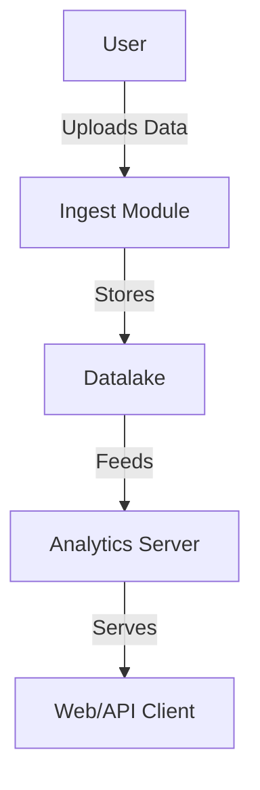

# patent_scraper

## Introduction
`patent_scraper` is a modular Python project for scraping, storing, and analyzing patent data. It provides tools to build a local datalake, ingest patent data, and run analytics via a web server.

## Overview of Modules
- **data_ingest.py**: Handles ingestion of patent data into the datalake.
- **data_prepare.py**: Prepares and cleans patent data for further processing.
- **data_transform.py**: Transforms raw or prepared data into analysis-ready formats.
- **data_analyse.py**: Provides analytics and reporting on patent data and exposes a REST API.

## Prerequisites
- Python 3.13.2 (recommended to use [pyenv](https://github.com/pyenv/pyenv#installation))
- [Poetry](https://python-poetry.org/docs/) for dependency management
- Bash shell (for running provided scripts)

## Quickstart
1. **Clone the repository**
   ```bash
   git clone <repo-url>
   cd patent_scraper
   ```
2. **Set up Python**
   ```bash
   pyenv update
   pyenv local 3.13.2
   ```
3. **Install dependencies**
   ```bash
   pip install poetry==1.8.4
   poetry install
   ```

## Build the Datalake
To create a mock datalake structure:
```bash
./create_datalake.sh
```

## Get some data
Place any downloaded patent zip files into the appropriate datalake directory as needed.
Currently supports: https://data.uspto.gov/ui/datasets/products/files/PTGRXML/{year}/*.zip
Recommended:
https://data.uspto.gov/ui/datasets/products/files/PTGRXML/2025/ipg250506.zip
https://data.uspto.gov/ui/datasets/products/files/PTGRXML/2025/ipg250429.zip
https://data.uspto.gov/ui/datasets/products/files/PTGRXML/2025/ipg250422.zip
https://data.uspto.gov/ui/datasets/products/files/PTGRXML/2025/ipg250415.zip

as there is definitely some synthetic biology stuff in there (CTC = G16B*) . 

place them in the staging directory:
```bash
cd ./datalake/staging/
```

## Clean and Populate the Datalake
To clean and populate the datalake, use the following scripts:

- **Clean the datalake:**
  ```bash
  ./datalake/clean_datalake.sh
  ```
  everything historical has been removed, except from staging.
  You can use this script again to cleanup later before running again, if desired.

- **Populate the datalake:**
  ```bash
  ./datalake/populate_datalake.sh
  ```
  files have now been moved from staging to raw

## Ingest Data
Run the ingestion script to process and load data from 'raw'
```bash
poetry run python patent_scraper/src/data_ingest.py
```

## Run the Analytics Server
Start the Flask analytics server:
```bash
poetry run python patent_scraper/src/data_analyse.py
```
The server will be available at [http://localhost:5000](http://localhost:5000).

## API Documentation
The analytics server exposes several REST API endpoints for querying patent data. 

#### G16B is the CPC classification for Synthetic Biology.

Below are the available endpoints and example requests:

### 1. Get Distinct Inventors
- **Endpoint:** `GET /api/inventors`
- **Query Parameters:**
  - `cpc_class` (optional): Filter by CPC classification (supports regex if `use_regex=true`)
  - `use_regex` (optional): Set to `true` to interpret `cpc_class` as a regex (default: false)
- **Example:**
  ```bash
  curl "http://localhost:5000/api/inventors?cpc_class=^G16B*&use_regex=true"
  ```
- **Response:**
  ```json
  ["Inventor A", "Inventor B", ...]
  ```

### 2. Get Distinct Assignees
- **Endpoint:** `GET /api/assignees`
- **Query Parameters:**
  - `cpc_class` (optional)
  - `use_regex` (optional)
- **Example:**
  ```bash
  curl "http://localhost:5000/api/assignees?cpc_class=^G16B*&use_regex=true"
  ```
- **Response:**
  ```json
  ["Assignee X", "Assignee Y", ...]
  ```

### 3. Get Distinct Titles
- **Endpoint:** `GET /api/titles`
- **Query Parameters:**
  - `cpc_class` (optional)
  - `use_regex` (optional)
- **Example:**
  ```bash
  curl "http://localhost:5000/api/titles?cpc_class=^G16B*&use_regex=true"
  ```
- **Response:**
  ```json
  ["Title 1", "Title 2", ...]
  ```

### 4. Get Summary
- **Endpoint:** `GET /api/summary`
- **Query Parameters:**
  - `cpc_class` (optional)
  - `use_regex` (optional)
- **Example:**
  ```bash
  curl "http://localhost:5000/api/summary?cpc_class=^G16B*&use_regex=true"
  ```
- **Response:**
  ```json
  {
    "inventors": ["Inventor A", ...],
    "assignees": ["Assignee X", ...],
    "titles": ["Title 1", ...]
  }
  ```

## Control & Message Flow


## FUTURE
- Validation of XML files
- Proper operation of datalake archiving etc
